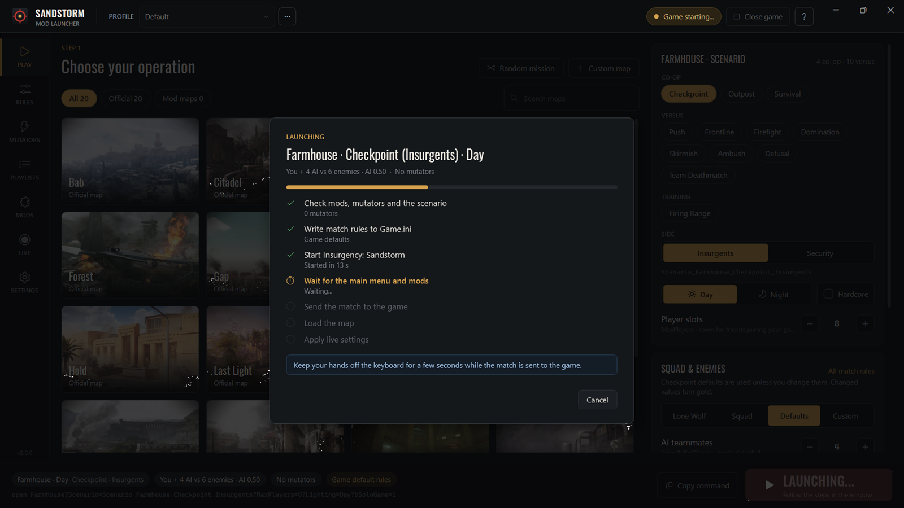

# Sandstorm Mod Launcher

Local play launcher for **Insurgency: Sandstorm**. Play offline with bots, mods and mutators, set up your squad and the enemy, and change any match rule without typing console commands.

[](https://github.com/goranbalsic/insurgency-sandstorm-mod-launcher/actions/workflows/build.yml)
[](https://github.com/goranbalsic/insurgency-sandstorm-mod-launcher/releases/latest)
[](LICENSE)


It replaces the old Local Play Launcher (0.11.x), which no longer finds mutators since mods moved to the current mod.io layout. Profiles and presets from the old launcher can be imported.

## Features

- All official maps and scenarios plus mod maps, day or night, Hardcore Checkpoint
- Lone Wolf, a squad of AI teammates, or your own mix of teammates, enemy counts and AI difficulty, starting from each mode's real defaults
- All official and mod mutators, read from your installed mod.io mods, with load order and presets
- Every game mode setting (100+ per mode): rounds, time, waves, objectives, counter-attacks, respawns, supply, friendly fire, HUD
- The official rulesets and all official online playlists, playable offline
- Live match control: restart rounds, add time, respawn or freeze bots, change rules mid-match
- Profiles, custom map entries, extra Game.ini lines and after-load commands for advanced setups
- One click: starts the game, waits for the main menu and loads the match

| Rules | Mutators |
| --- | --- |
|  |  |
| **Live match control** | **Launching** |
|  |  |

## Download

Get the zip from [Releases](https://github.com/goranbalsic/insurgency-sandstorm-mod-launcher/releases/latest), extract it anywhere and run `SandstormModLauncher.exe`. No installer, no admin rights.

Requirements: Windows 10 or 11, Insurgency: Sandstorm, .NET Framework 4.8 (part of Windows 10 1903 and newer).

## How it works

1. Rules you change are written to your `Game.ini` inside a marked block (backed up first), so bots spawn with your values from the first second.
2. The launcher starts the game if needed and follows the game log until the main menu is up.
3. It opens the game console, pastes the `open` command with map, scenario, lighting and mutators, and checks the log that the game accepted it.
4. After the map loads it applies your rules again with admin commands.

If the console key does not work on your keyboard layout, use Settings > Console key > Set up F10 and restart the game once.

## Is it safe?

All source code is in this repository, and every release is built from it by [GitHub Actions](.github/workflows/release.yml). Each release lists the SHA-256 of its files and has a signed build provenance record.

What the program does on your PC:

- Reads the game's .pak files, configs and log, and your mod.io folder (read only)
- Writes only its own block in `Game.ini`, and adds F10 to `Input.ini` only when you press "Set up F10". Both files are backed up first
- Sends keystrokes only to the Insurgency: Sandstorm window, to open the console and paste the command
- Keeps its settings in `%APPDATA%\SandstormModLauncher`
- Loads mod logo images from mod.io. No other network access, no telemetry
- Never changes game files and does not touch the anti-cheat. It is for local play only

The exe is not code-signed, so SmartScreen may show "Windows protected your PC" (More info > Run anyway). Some antivirus tools are wary of programs that send keystrokes. To check a download:

```powershell
# compare with the SHA-256 on the release page
Get-FileHash .\SandstormModLauncher-v1.0.0.zip -Algorithm SHA256

# check that the file was built by this repository's workflow (GitHub CLI)
gh attestation verify .\SandstormModLauncher-v1.0.0.zip --repo goranbalsic/insurgency-sandstorm-mod-launcher
```

Or build it yourself and use your own exe.

## Build from source

Needs the [.NET SDK](https://dotnet.microsoft.com/download) 8 or newer on Windows.

```
git clone https://github.com/goranbalsic/insurgency-sandstorm-mod-launcher.git
cd insurgency-sandstorm-mod-launcher
dotnet build -c Release
```

The exe ends up in `bin\Release\net48\`. `SandstormModLauncher.exe --selftest report.txt` writes a report of what it finds in your game and mods.

## FAQ

**Does it work with mods from the in-game mod browser?**
Yes. Subscribe in the game, start it once so the mods download, and they show up in the launcher.

**Does it change anything for online play?**
No. The Game.ini block only affects matches you host yourself. Settings > "Remove launcher rules from Game.ini" takes it out.

**Why does changing the number of AI teammates restart the game?**
The game reads the friendly bot count only at startup. The launcher notices and asks before restarting.

**Steam or Epic?**
Made and tested with the Steam version. The Epic install is detected too.

## License

MIT, see [LICENSE](LICENSE). The Oswald font is under the SIL Open Font License ([Assets/OFL.txt](Assets/OFL.txt)).

Insurgency: Sandstorm is a trademark of its owners. This project is not affiliated with New World Interactive or Focus Entertainment.
