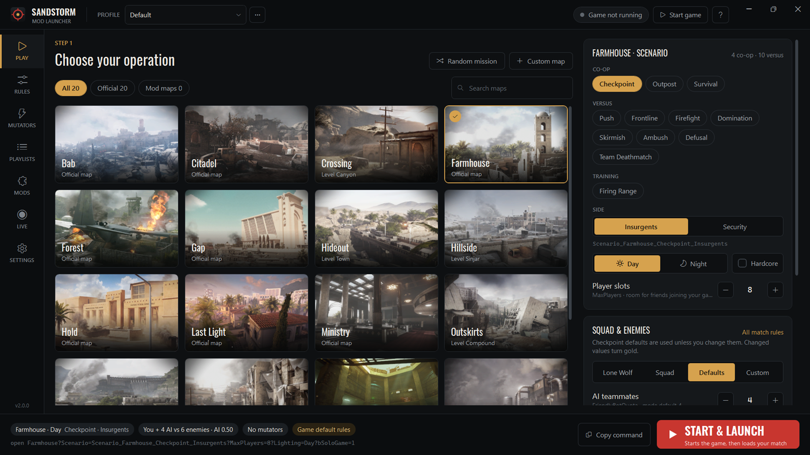
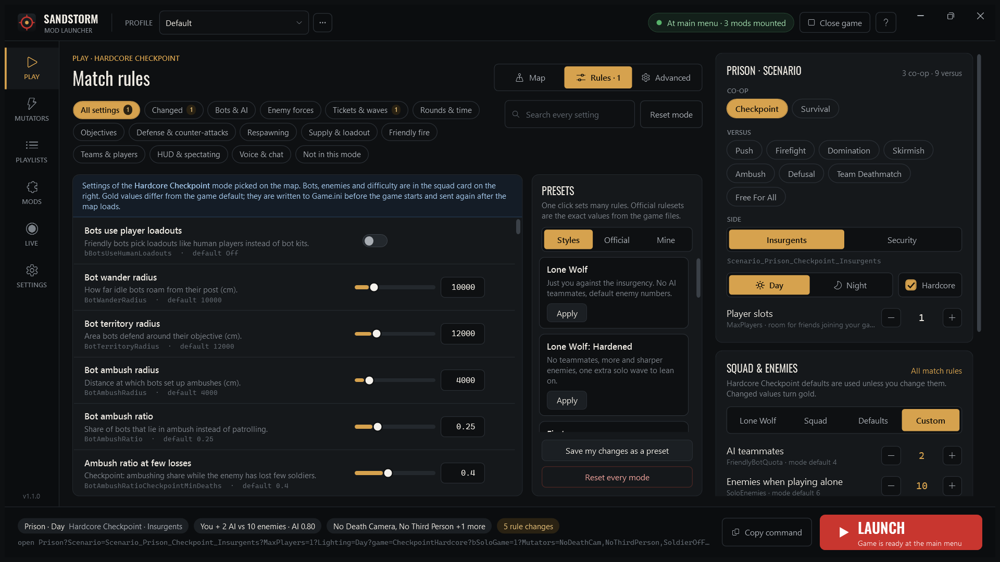
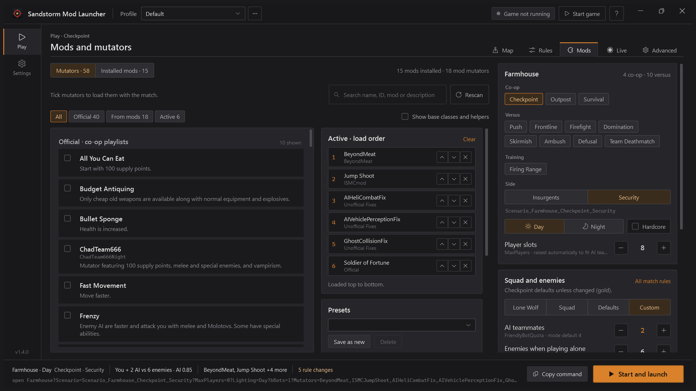
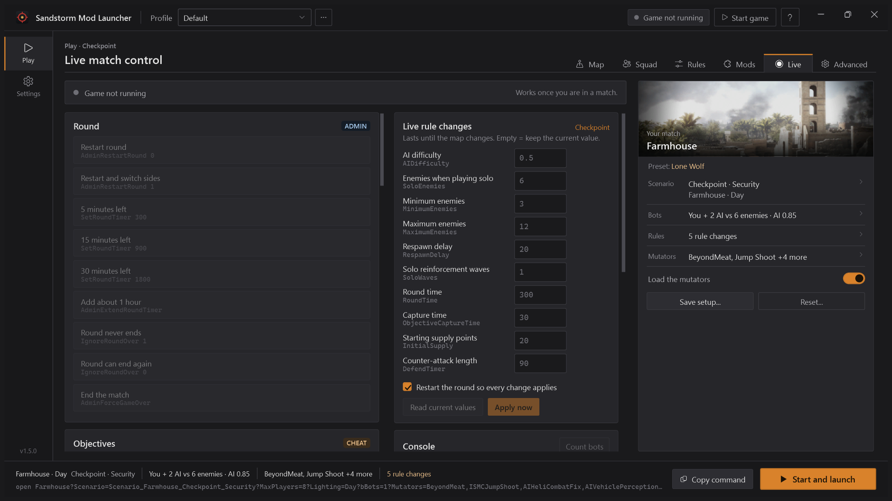
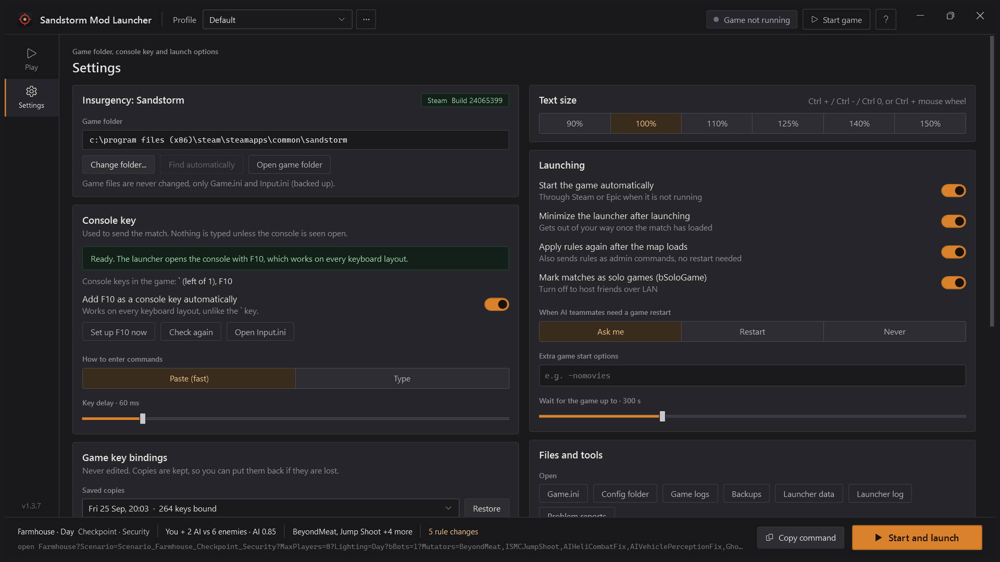

# Sandstorm Mod Launcher

Local play launcher for **Insurgency: Sandstorm**. Play offline with bots, mods and mutators, set up your squad and the enemy, and change any match rule without typing console commands.

[](https://github.com/goranbalsic/insurgency-sandstorm-mod-launcher/actions/workflows/build.yml)
[](https://github.com/goranbalsic/insurgency-sandstorm-mod-launcher/releases/latest)
[](LICENSE)



## Features

- All official maps and scenarios plus mod maps, day or night, Hardcore Checkpoint
- Three pages. Play: map, squad and enemies, every match rule of the selected mode, the official playlists and live control of the running match. Mods: all mutators (official ones grouped by the co-op and versus playlists that use them) and the installed mods. Settings
- Lone Wolf, a squad of AI teammates, or your own mix of teammates, enemy counts and AI difficulty, starting from each mode's real defaults. Versus with bots as 1v1, 5v5, 10v10 or any team size
- All official and mod mutators, read from the mods the game has installed, with load order and presets
- Every game mode setting (100+ per mode): rounds, time, waves, objectives, counter-attacks, respawns, supply, friendly fire, HUD
- The official rulesets and all official online playlists, playable offline
- Live match control: restart rounds, set the clock, respawn or freeze bots, change rules mid-match, and every console command the game has, searchable
- Profiles, custom map entries, extra Game.ini lines and after-load commands for advanced setups
- One click: starts the game, waits for the main menu and loads the match
- Fully offline: no accounts, no network access, no telemetry

| Match rules | Mods and mutators |
| --- | --- |
|  |  |
| **Live match control** | **Settings** |
|  |  |

## Download

Get the zip from [Releases](https://github.com/goranbalsic/insurgency-sandstorm-mod-launcher/releases/latest), extract it anywhere and run `SandstormModLauncher.exe`. No installer, no admin rights.

Requirements: Windows 10 or 11, Insurgency: Sandstorm, .NET Framework 4.8 (part of Windows 10 1903 and newer).

## How it works

1. Rules you change are written to your `Game.ini` while the game is closed (backed up first), one line per setting, so bots spawn with your values from the first second. Older copies of the same settings are removed, because the game uses the first value it finds. When the game is already running, the rules are sent with admin commands after the map loads.
2. The launcher starts the game if needed and follows the game log until the main menu is up.
3. It presses the console key and checks on screen that the console line opened. Only then does it paste the `open` command (map, scenario, lighting, mutators) and press Enter. If the console is not clearly open it stops without pressing anything else, so no key can land in the game's menus.
4. If the game was already running, it sends your rules with admin commands once the map and its loading screen are done.

The launcher uses the ` key when your keyboard layout has it. It is missing on many layouts (Serbian, German, French and others), so while the game is closed the launcher also adds F10 as a console key, which works on every layout.

## Is it safe?

All source code is in this repository, and every release is built from it by [GitHub Actions](.github/workflows/release.yml). Each release lists the SHA-256 of its files and has a signed build provenance record.

What the program does on your PC:

- Reads the game's .pak files, configs and log, and the game's mod folder (read only)
- Writes only match rules (game mode settings) in `Game.ini`, and adds F10 as a console key in `Input.ini` while the game is closed. Both files are backed up first
- Keeps copies of your game key bindings before it sends any key to the game, and can put them back (Settings > Game key bindings). It never edits them itself
- Sends keystrokes only to the Insurgency: Sandstorm window, and only after it has seen the console line open on screen
- Reads the bottom strip of the game picture to see the console line. The pictures stay on your PC (a few are kept in the log folder for troubleshooting)
- Keeps its settings and logs in `%APPDATA%\SandstormModLauncher`
- No network access, no telemetry. Never changes game files and does not touch the anti-cheat. It is for local play only

The exe is not code-signed, so SmartScreen may show "Windows protected your PC" (More info > Run anyway). Some antivirus tools are wary of programs that send keystrokes. To check a download:

```powershell
# compare with the SHA-256 on the release page
Get-FileHash .\SandstormModLauncher-v1.2.4.zip -Algorithm SHA256

# check that the file was built by this repository's workflow (GitHub CLI)
gh attestation verify .\SandstormModLauncher-v1.2.4.zip --repo goranbalsic/insurgency-sandstorm-mod-launcher
```

Or build it yourself and use your own exe.

## Troubleshooting

Settings > "Something went wrong?" saves a report to `%APPDATA%\SandstormModLauncher\logs\reports`: launcher logs, settings, the end of the game log (account lines removed) and the console pictures. A report is also saved automatically when a launch fails. Every run of the launcher has its own log in `logs\sessions`.

## Build from source

Needs the [.NET SDK](https://dotnet.microsoft.com/download) 8 or newer on Windows.

```
git clone https://github.com/goranbalsic/insurgency-sandstorm-mod-launcher.git
cd insurgency-sandstorm-mod-launcher
dotnet build -c Release
```

The exe ends up in `bin\Release\net48\`. Command line tools:

- `--selftest report.txt` writes a report of what it finds in your game and mods
- `--probe-test out.txt shot1.png ...` checks the console detection against screenshots of the game
- `--render folder` draws every page to PNG files without opening a window
- `--data folder` keeps settings and logs in another folder (for testing)

## FAQ

**Does it work with mods from the in-game mod browser?**
Yes. Subscribe in the game, start it once so the mods download, and they show up in the launcher.

**Does it change anything for online play?**
No. The Game.ini block only affects matches you host yourself. Settings > "Remove launcher rules from Game.ini" takes it out.

**Why does changing the number of AI teammates restart the game?**
The game reads the friendly bot count only at startup. The launcher notices and asks before restarting.

**Steam or Epic?**
Made and tested with the Steam version. The Epic install is detected too.

## License

MIT, see [LICENSE](LICENSE). The Oswald font is under the SIL Open Font License ([Assets/OFL.txt](Assets/OFL.txt)).

Insurgency: Sandstorm is a trademark of its owners. This project is not affiliated with New World Interactive or Focus Entertainment.
