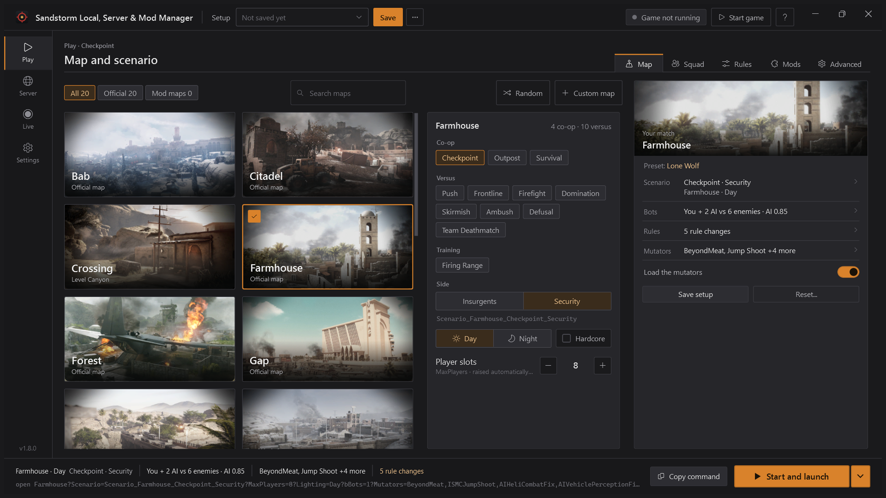
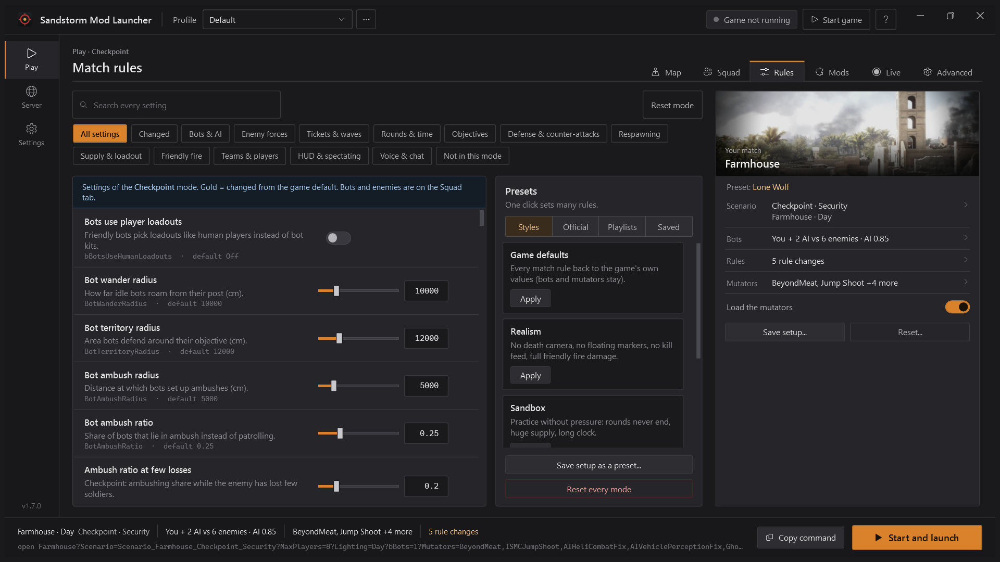
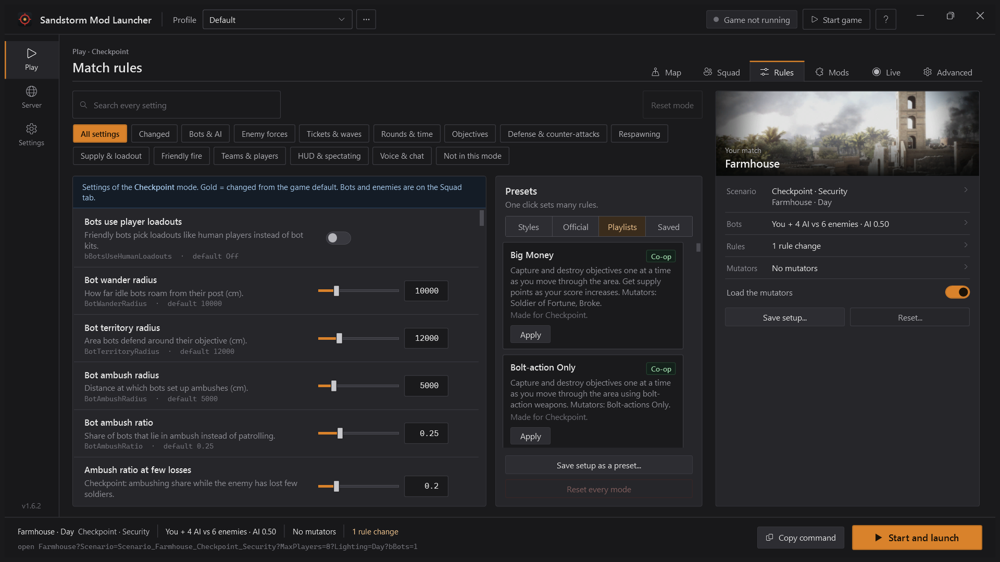
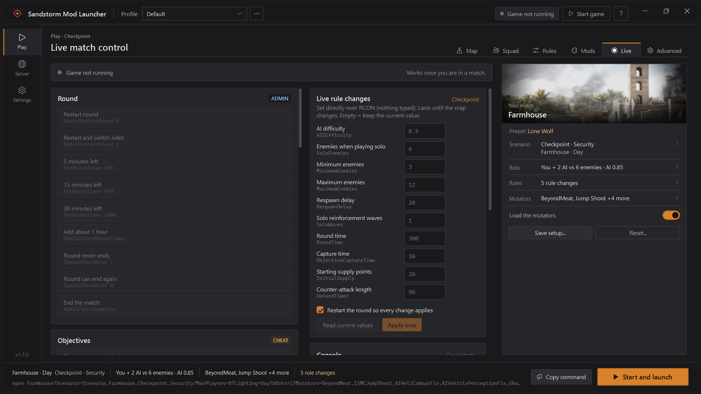
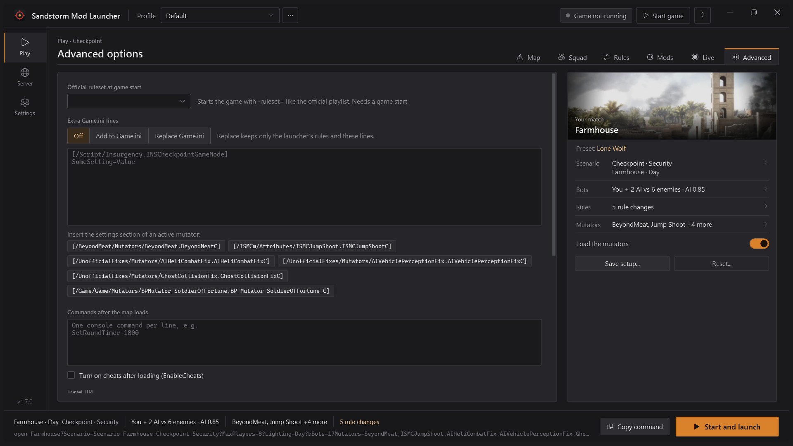
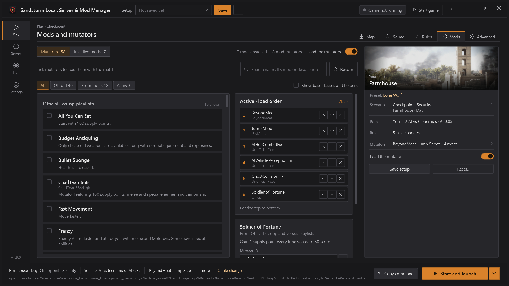
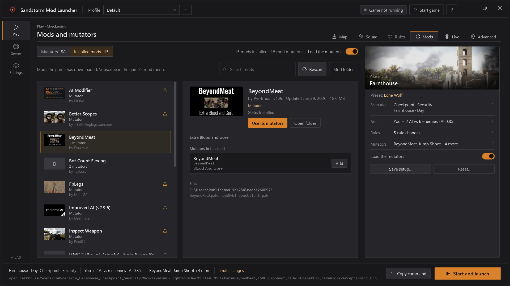
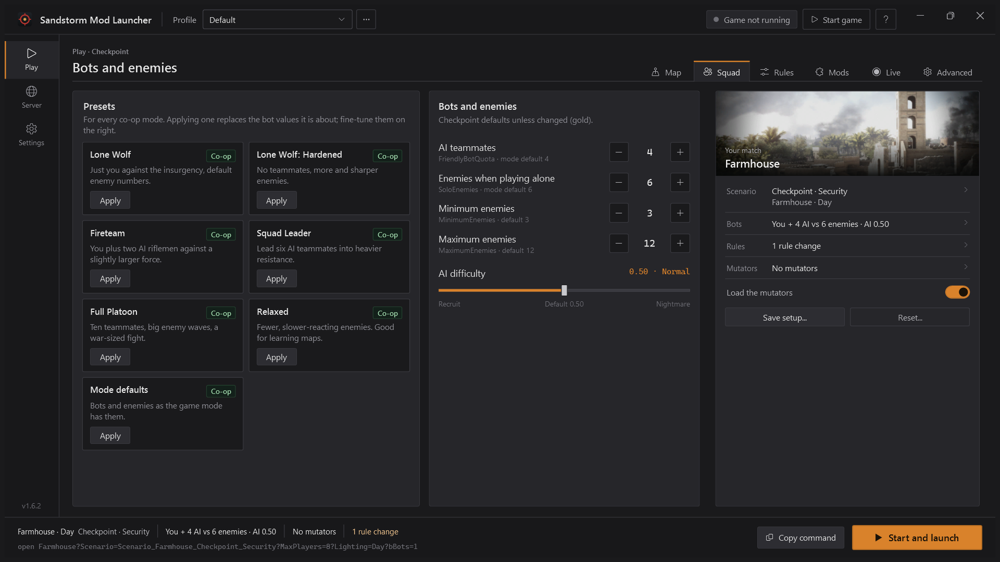
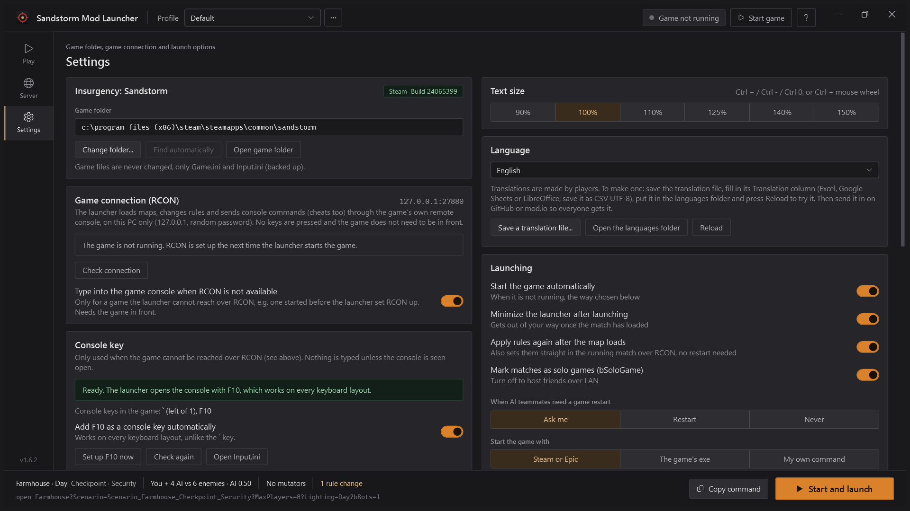
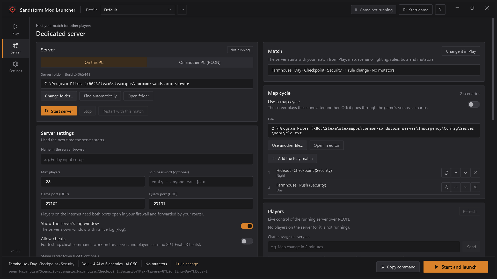

# Sandstorm Local, Server & Mod Manager

Local play, the dedicated server, mods, match rules and live control for **Insurgency: Sandstorm**, in one app. Set up a match once (map, bots, enemies, every rule, mutators) and play it offline on your PC or run it on your dedicated server, without typing console commands. Formerly "Sandstorm Mod Launcher". In your language, too: translations are made by players.

[](https://github.com/goranbalsic/insurgency-sandstorm-mod-launcher/actions/workflows/build.yml)
[](https://github.com/goranbalsic/insurgency-sandstorm-mod-launcher/releases/latest)
[](LICENSE)



## Features

- All official maps and scenarios plus mod maps, day or night, Hardcore Checkpoint
- Play page with fixed tabs: Map (map and scenario), Squad (teammates, enemies and AI difficulty, with presets), Rules (every setting of the selected mode, with presets: play styles, official rulesets and the official online playlists, searchable), Mods (all mutators, official ones grouped by the playlists that use them, and the mods installed on your PC) and Advanced. A "Your match" column shows the whole setup on every tab
- One way to keep a match: saved setups. The Setup bar at the top saves everything (map, scenario, day or night, bots, every rule, the mutators and the Advanced options), loads a saved setup back exactly, and shows when the setup on screen has changes that are not saved
- Presets that behave: a squad preset changes only the bot values, and each rules preset or playlist takes the previous one's rules, mutators, night and hardcore back out before it puts in its own (what you changed by hand stays)
- Lone Wolf, a squad of AI teammates, or your own mix of teammates, enemy counts and AI difficulty, starting from each mode's real defaults. Separate squad settings for co-op and versus; versus with bots as 1v1, 5v5, 10v10 or any team size
- All official and mod mutators, read from the mods the game has installed, with load order and presets
- Every game mode setting (100+ per mode): rounds, time, waves, objectives, counter-attacks, respawns, supply, friendly fire, HUD
- The official rulesets and the official online playlists as presets, tagged co-op (PvE, solo or with AI) or versus (against bots offline)
- Live page: control of the running match. Restart rounds, change rules mid-match, respawn or freeze bots, set the clock, and every console command the game has, searchable
- One button for both: "Start and launch" plays the match on this PC; switch it to "Start the server" and the same match starts on your dedicated server (the Server page opens first when the server is not set up yet)
- One click: writes your rules, starts the game, waits for the main menu and loads the match through the game's own remote console (RCON, on this PC only). No keys are pressed, no window has to be in front, and the game confirms the map load and every rule it sets
- Cheats, the versus AI difficulty and your own console commands go over RCON too: the game runs them as if you had typed them into its console, but nothing is typed
- Dedicated server: the match you set up in Play runs on the Insurgency: Sandstorm dedicated server with the same rules and mutators, plus the server's own settings (name, ports, player slots, join password, admins, map cycle, mods, Steam server token, game stats). Start, stop and restart it from the launcher, and control it live over RCON: players, kick and ban, chat, change the map, restart the round, any admin command. Works for a server on this PC or, over RCON, on another one
- Map cycle editor: build the server's map cycle from the Play page, or point it at any MapCycle.txt you already have
- Any language: every text of the launcher is in one table that players translate with Excel, Google Sheets or LibreOffice (see [Translations](#translations))
- Custom map entries, extra Game.ini lines and after-load commands for advanced setups
- Adjustable text size (90% to 150%, Ctrl + / Ctrl - or Ctrl + mouse wheel) in a plain, classic Windows look
- Send a problem report straight from the launcher: you see the cleaned report (no names, IDs or screenshots) first, and it is sent only when you press Send. You can post it on GitHub instead
- Updates itself quietly from this repository's releases, checked against the published SHA-256 (can be turned off)
- Plays offline: no accounts, no telemetry. The only automatic connection is a tiny update check every few minutes while the launcher is open

| Match rules | Presets: official playlists |
| --- | --- |
|  |  |
| **Live match control** | **Advanced** |
|  |  |
| **Mutators** | **Installed mods** |
|  |  |
| **Squad: bots and enemies** | **Settings** |
|  |  |
| **Dedicated server** | |
|  | |

## Download

Get the zip from [Releases](https://github.com/goranbalsic/insurgency-sandstorm-mod-launcher/releases/latest), extract it anywhere and run `SandstormModLauncher.exe`. No installer, no admin rights. From then on it keeps itself up to date: a new version is put in place in the background and used from the next start.

Requirements: Windows 10 or 11, Insurgency: Sandstorm, .NET Framework 4.8 (part of Windows 10 1903 and newer).

## How it works

1. Rules you change are written to your `Game.ini` while the game is closed (backed up first), one line per setting, so bots spawn with your values from the first second. Older copies of the same settings are removed, because the game uses the first value it finds.
2. The launcher starts the game if needed and follows the game log until the main menu is up.
3. It sends the `open` command (map, scenario, lighting, mutators) through the game's own RCON server, the remote console that server admins use. The game runs it as if you had typed it into its console (the engine's `defer` command), because only then does the game switch from its menu into play. The game confirms the load in its log. Nothing is typed and the game can stay in the background, so no key can ever land in a menu.
4. If the game was already running, the rules are set in the match over RCON, and the game answers with each new value.

RCON is set up by the launcher: it listens on 127.0.0.1 only (this PC, never the network), with a random password, through the `[Rcon]` section of `Game.ini`. The game starts it however you start the game, from the launcher or from Steam.

Cheats, the versus AI difficulty and your own after-load commands go the same way: console commands the game runs for the player, sent over RCON. The game confirms the AI difficulty in its log.

The game starts through Steam (or Epic) by default. Settings > Launching can start the game's own exe directly instead, or run your own command (a script or another tool); the launcher's start options are added at the end, or where you put `{options}`.

Typing into the game's console is only a fallback for a game the launcher cannot reach over RCON (for example one started before the launcher set RCON up). Then the launcher presses the console key, checks on screen that the console line opened, pastes the line, and checks each step before it presses Enter. It uses the ` key when your keyboard layout has it; on layouts without it (Serbian, German, French and others) it adds F10 as a console key while the game is closed.

## Dedicated server

Install the dedicated server from Steam (Library > Tools > "Insurgency: Sandstorm Dedicated Server") or with SteamCMD (app 581330). The Server page finds it on its own, or you pick its folder.

1. Set up the match on the Play page as usual: map, scenario, day or night, bots, rules, mutators.
2. On the Server page, fill in the server's own settings: name, ports, player slots, join password, admins (Steam IDs), mods (mod.io ids) and, for a server in the online browser, a Steam server token (GSLT).
3. Press Start. The launcher writes the server's `Game.ini`, `Admins.txt`, `MapCycle.txt` and `Mods.txt` (each backed up first), starts `InsurgencyServer.exe` and waits until the map is loaded and the server answers over RCON.

While it runs, the page shows the players and lets you kick, ban, write to the chat, load the Play match, restart the round and send any admin command. The command line the launcher uses is shown too, so you can copy it into your own scripts.

The map cycle is either built on the Server page (add the Play match, reorder, day or night) or any `MapCycle.txt` you pick; the server gets a copy in its `Config\Server` folder when it starts.

For a server on another PC, switch the page to "On another PC (RCON)" and enter its address, RCON port and password: player control and admin commands then work over the network. On the server PC, "Allow RCON from other PCs" opens RCON on the network (a strong random password, and the game locks out an address after 5 wrong tries); keep the RCON port closed in your router unless you need it from outside.

For mods, the server needs a mod.io access token (from mod.io > your account > Access); the launcher saves it in the server's `Engine.ini` and never shows or logs it.

## Translations

Every text of the launcher is written in English in the code and listed in one table, [Resources/Languages/template.csv](Resources/Languages/template.csv). A translation is the same table with the Translation column filled in:

1. Settings > Language > "Save a translation file...". It saves the table with every text (and the translations a language already has, to bring it up to date).
2. Open it with Excel, Google Sheets or LibreOffice and fill in the Translation column. The Where column says where each text appears. Keep `{0}`, `{1}` (values the launcher puts in) and line breaks. Fill in the first two rows: the name of the language in that language, and your name if you want it shown.
3. Save it as CSV UTF-8 in the languages folder (Settings > Language > "Open the languages folder") and press Reload to try it. Texts you have not translated yet stay in English.
4. Send it in: a pull request that adds it to `Resources/Languages` (the file name is the language code, for example `zh-CN.csv`), or attach it to an issue or a mod.io comment. It then comes with the next release.

Game names (maps, mutators, mods, console commands) come from the game and stay as the game shows them.

For developers: wrap every new text on screen in `T("...")`, or `F("... {0} ...", value)` for texts with values; texts in the XAML pages are translated on their own. Then run `--cli translation-template <repo>` to update the table; `--cli translation-check <repo>` fails when the table is out of date.

## Is it safe?

All source code is in this repository, and every release is built from it by [GitHub Actions](.github/workflows/release.yml). Each release lists the SHA-256 of its files and has a signed build provenance record.

What the program does on your PC:

- Reads the game's .pak files, configs and log, and the game's mod folder (read only)
- Writes only match rules (game mode settings) and its RCON settings in `Game.ini`, and adds F10 as a console key in `Input.ini` while the game is closed. Both files are backed up first
- Talks to the game over RCON on 127.0.0.1 (this PC only) with a random password; nothing from outside can reach it. The password never appears in logs or problem reports
- Keeps copies of your game key bindings before it sends any key to the game, and can put them back (Settings > Game key bindings). It never edits them itself
- Sends keystrokes only when it cannot reach the game over RCON (and Settings allow it), only to the Insurgency: Sandstorm window, and only after it has seen the console line open on screen
- Reads the bottom strip of the game picture to see the console line. The pictures stay on your PC (a few are kept in the log folder for troubleshooting)
- For the dedicated server (only when you use the Server page): writes the server's `Game.ini`, `Engine.ini` (the mod.io token, only when you save one), `Admins.txt`, `MapCycle.txt` and `Mods.txt`, each backed up first, and starts or stops `InsurgencyServer.exe`. The server itself is a network program by design; its RCON listens on the network only when you allow it
- Keeps its settings and logs in `%APPDATA%\SandstormModLauncher`
- Sends a problem report only when you press Send in Settings > "Something went wrong?", after showing you all of it
- No telemetry. Its only automatic network access is the update check: it reads the latest release of this repository from GitHub, and when there is a newer one it downloads the zip, checks it against the release's SHA256SUMS.txt and replaces its own exe (Settings > About turns this off)
- Never changes game files and does not touch the anti-cheat. It is for local play only

The exe is not code-signed, so SmartScreen may show "Windows protected your PC" (More info > Run anyway). Some antivirus tools are wary of programs that send keystrokes. To check a download:

```powershell
# compare with the SHA-256 on the release page
Get-FileHash .\SandstormModLauncher-vX.Y.Z.zip -Algorithm SHA256

# check that the file was built by this repository's workflow (GitHub CLI)
gh attestation verify .\SandstormModLauncher-vX.Y.Z.zip --repo goranbalsic/insurgency-sandstorm-mod-launcher
```

Or build it yourself and compare (see below).

## Troubleshooting

Settings > "Something went wrong?" saves a report to `%APPDATA%\SandstormModLauncher\logs\reports`: launcher logs, settings, the end of the game log (account lines removed) and the console pictures. A report is also saved automatically when a launch fails. Every run of the launcher has its own log in `logs\sessions`.

To send it to me, use "Send a report..." next to it. The launcher shows you the whole report first. It leaves out your Windows user and PC name, user folders, Steam IDs, e-mail and IP addresses, account and online lines, screenshots and console history. "Send" delivers it to the project's report inbox (when the inbox is not reachable, it opens the GitHub form instead); "Post it on GitHub instead" opens the [problem report form](https://github.com/goranbalsic/insurgency-sandstorm-mod-launcher/issues/new?template=problem-report.yml) filled in, and nothing is posted until you press Submit.

If Game.ini cannot be written ("access to the path is denied"), the file was usually set to read-only by hand or by another tool. The launcher writes read-only files and keeps them read-only; if it still fails, another program has the file open or the folder is protected.

## Build it yourself

Build it to check that it matches the released program, or to work on your own version. Needs the [.NET SDK](https://dotnet.microsoft.com/download) 8 or newer on Windows.

```
git clone https://github.com/goranbalsic/insurgency-sandstorm-mod-launcher.git
cd insurgency-sandstorm-mod-launcher
dotnet build -c Release
```

The exe ends up in `bin\Release\net48\`. An exe you build yourself reports new releases but does not replace itself; only release builds (`-p:OfficialBuild=true`) do. Command line tools:

- `--selftest report.txt` writes a report of what it finds in your game and mods
- `--probe-test out.txt shot1.png ...` checks the console detection against screenshots of the game
- `--render folder` draws every page to PNG files without opening a window
- `--data folder` keeps settings and logs in another folder (for testing)
- `--cli command` works on the setup without a window: `status`, `presets`, `apply`, `set`, `mutators`, `plan`, `save`, `reset`, and `torture [steps] [seed]`, a random stress test that checks the whole setup logic after every step, including that what you set is what the game gets (see `Services/Cli.cs`)
- `--cli rcon "command"` sends commands to the running game over RCON; `rcon-status` checks the connection; `rcon-torture [steps] [seed]` tests the RCON code against a fake game that splits, delays and drops its answers
- `--cli server-status`, `server-plan`, `server-start`, `server-stop`, `server-players`, `server-travel`, `server-rcon "command"`, `server-set <setting> <value>` and `mapcycle show | add | remove n | clear` run the dedicated server without the window
- `--cli translation-template [repo] [out.csv]` makes the translation table from the source; `translation-check [repo]` checks that the table the launcher carries is up to date
- `--ui-torture out.txt [steps] [seed]` drives the real window at random (maps, presets, rules, mutators, saved setups, the Setup bar, languages, text sizes) and checks after every step that the screen, the saved profile and the launch plan agree. Use it with `--data` and a copy of a data folder

## Contributing

Forks and pull requests are welcome: new features, fixes, support for more maps and mods. Fork the repository, make your change, run the tests that fit it (`--cli torture`, `--ui-torture`, `--cli rcon-torture`, see above) and open a pull request against `main`. Have an idea but no time to build it? Open an issue and describe it. See [CONTRIBUTING.md](CONTRIBUTING.md) for the details.

## Releasing

Raise `<Version>` in `SandstormModLauncher.csproj`, add the changes to `packaging/release-notes.md` and push to `main` (or push a `vX.Y.Z` tag). The [release workflow](.github/workflows/release.yml) builds, checksums and publishes the release, and installed launchers that are open pick it up within a few minutes.

## FAQ

**Does it work with mods from the in-game mod browser?**
Yes. Subscribe in the game, start it once so the mods download, and they show up in the launcher.

**Does it change anything for online play?**
No. The Game.ini block only affects matches you host yourself. Settings > "Remove launcher rules from Game.ini" takes it out.

**Why does changing the number of AI teammates restart the game?**
The game reads the friendly bot count only at startup. The launcher notices and asks before restarting.

**Steam or Epic?**
Made and tested with the Steam version. The Epic install is detected too.

**Can the game start without going through Steam?**
Yes: Settings > Launching > "Start the game with" picks the game's own exe, or your own command. Online features still need Steam running.

**Can the server use a MapCycle.txt I already have?**
Yes. On the Server page, turn on the map cycle and pick your file ("Use another file..."). The launcher shows its entries and edits them there; the server gets a copy when it starts.

**Is the launcher in my language?**
Settings > Language lists the languages players have translated. None in yours yet? You can make one in an evening with a spreadsheet, see [Translations](#translations).

## License

Open source for non-commercial use, under the [PolyForm Noncommercial License 1.0.0](LICENSE): use it, study it, change it, fork it and share your version, for anything that does not make money. Selling it, or using it in a commercial product or service, is not allowed. Keep the license and its `Required Notice` line with every copy. Earlier versions keep the license they were released with. The Oswald font is under the SIL Open Font License ([Assets/OFL.txt](Assets/OFL.txt)).

Insurgency: Sandstorm is a trademark of its owners. This project is not affiliated with New World Interactive or Focus Entertainment.
